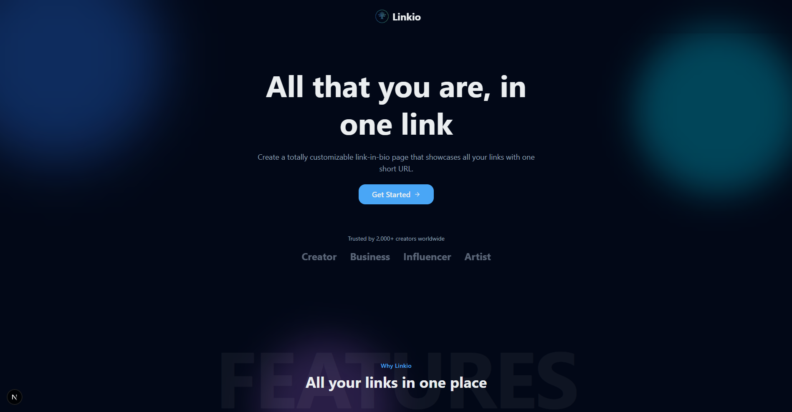

# Linkio – The Reimagined Link-in-Bio Platform



> Curate, organize, and schedule every link, media preview, and music drop – all from a single realtime dashboard.

Curate, organize and schedule everything you want to share with others, all in a page made by you, for you.

<div align="center">
  
  
  
  
  

</div>

## ✨ Features

- **Realtime link library** – drag-and-drop ordering powered by dnd-kit with live Convex updates.
- **Smart folders** – group, rename, reorder, and navigate between folders without page reloads.
- **Music link orchestration** – aggregate tracks, albums, and playlists across Spotify, Apple Music, Tidal, Deezer, and more using one-click metadata fetches.
- **Media previews** – embed YouTube video cards that automatically replace default URLs.
- **Scheduling rules** – decide when links go live; the public profile updates instantly as schedule windows open.
- **Analytics at a glance** – Tinybird & Convex pipelines surface daily performance insights inside the dashboard.
- **Pro-grade UI** – Apple-inspired mobile menu, Clerk auth widgets, and theme toggler crafted with Tailwind CSS + Shadcn components.
- **Audit-friendly** – music metadata, profile customization, and creatives are all stored consistently in Convex documents.

## 📚 Table of Contents

1. [Architecture Overview](#-architecture-overview)
2. [Project Structure](#-project-structure)
3. [Getting Started](#-getting-started)
4. [Environment Variables](#-environment-variables)
5. [Development Scripts](#-development-scripts)
6. [Useful Commands](#-useful-commands)
7. [Tech Stack](#-tech-stack)
8. [Roadmap](#-roadmap)
9. [Contributing](#-contributing)

## 🏗 Architecture Overview

Linkio is a full-stack application built with a modern, realtime-friendly toolkit:

- **Next.js 15 + React 19** for the application shell, ISR-ready marketing pages, and the Clerk-authenticated dashboard.
- **Convex** for the data layer (links, folders, music metadata, schedules) and realtime transports.
- **Clerk** for multi-tenant authentication, user management, and identity widgets.
- **Tinybird** for analytics ingest and dashboard metrics (daily link performance, country insights, etc.).
- **Tailwind CSS + Shadcn UI** for consistent design tokens, light/dark theming, dialogs, and form controls.
- **Framer Motion** and **dnd-kit** for animated transitions, sortable lists, and delightful interactions.

> The result is a link-in-bio experience that feels as responsive as a native app, while still being easy to host on Vercel.

## 🗂 Project Structure

```
linkio/
├── app/                              # App Router entry points (public + admin)
├── components/                       # Shared UI + dashboard modules
│   ├── forms/                        # Controlled form experiences (CreateLink, Customization, etc.)
│   ├── sections/                     # Marketing landing sections
│   └── ui/                           # Shadcn-wrapped primitives
├── convex/                           # Convex schema, auth config, and server functions
├── lib/                              # Utilities, analytics helpers, validators
├── public/                           # Static assets (logos, icons, OG images)
├── tinybird/                         # Pipes & datasources powering the analytics dashboard
├── package.json
├── tsconfig.json
└── README.md                         # ← you are here
```

## 🚀 Getting Started

### Prerequisites

- **Node.js** ≥ 20
- **pnpm** ≥ 9 (recommended) or npm 10+
- Convex account & CLI (`npm i -g convex`)
- Clerk account for auth (free tier works great)

### 1. Clone the repository

```bash
git clone https://github.com/<your-username>/linkio.git
cd linkio
```

### 2. Install dependencies

```bash
pnpm install
# or
npm install
```

### 3. Configure Convex & Clerk credentials

Fill in the environment variables described in the next section. Convex requires an `env` file per deployment (dev/prod) – the CLI will prompt you the first time you run `convex dev`.

### 4. Run the dev servers

```bash
pnpm dev
# launches Next.js + Convex side by side (see package.json scripts)
```

Visit `http://localhost:3000` to access the dashboard (Clerk handles sign-in). The public profile for any user slug is available at `/u/<username>`.

## 🔐 Environment Variables

You will typically create a `.env.local` at the repo root and configure Convex environment variables via `convex env set`.

| Variable | Description |
|----------|-------------|
| `NEXT_PUBLIC_CONVEX_URL` | Convex deployment URL ( auto-populated when running `convex dev`). |
| `CONVEX_DEPLOYMENT` | Convex project deployment name (optional for prod deploys). |
| `CLERK_PUBLISHABLE_KEY` | Clerk publishable key for the browser. |
| `CLERK_SECRET_KEY` | Clerk secret key for server-side usage. |
| `CLERK_JWT_ISSUER_DOMAIN` | Required for Convex JWT template validation. |
| `TINYBIRD_TOKEN` | (Optional) API token for Tinybird analytics pipelines. |

> Tip: Run `pnpm convex dev --until-success` once to ensure the local Convex deployment is ready before booting Next.js.

## 🛠 Development Scripts

All scripts can be executed with `pnpm <script>` (or `npm run <script>`):

| Script | Description |
|--------|-------------|
| `dev` | Runs Next.js and Convex dev servers concurrently. |
| `dev:frontend` | Starts the Next.js dev server only. |
| `dev:backend` | Starts the Convex dev server only. |
| `build` | Generates a production build. |
| `start` | Starts the Next.js production server. |
| `lint` | Runs Next.js ESLint checks. |
| `type-check` | Runs TypeScript compiler checks without emitting. |
| `test` | Placeholder – currently no automated tests. |


## 🧰 Useful Commands

```bash
# Deploy Convex functions & schema
pnpm convex deploy

# Push environment variables to Convex
pnpm convex env set <name> <value>

# Run Tinybird ingestion locally (requires CLI & token)
tinybird pipe run tinybird/pipes/link_analytics.pipe
```

## 🧱 Tech Stack

| Area | Tools |
|------|-------|
| Frontend | Next.js 15, React 19, App Router, Tailwind CSS, Shadcn UI, Framer Motion, dnd-kit |
| Backend | Convex queries & mutations, Tinybird analytics pipes, Clerk auth webhooks |
| Auth | Clerk universal login, JWT template integrated with Convex |
| Forms | React Hook Form + Zod validation |
| Media | Music metadata scrapers (Spotify, Apple Music, Tidal, Deezer), YouTube oEmbed previews |
| Tooling | TypeScript, ESLint, Prettier, npm-run-all, pnpm |

---

## 🗺 Roadmap

- [ ] Public template gallery for designers/influencers.
- [ ] Advanced analytics filters (per link, per device, retention cohorts).
- [ ] Automated Tinybird ingestion for schedule-triggered campaigns.
- [ ] PWA offline caching of link previews.
- [ ] Automated tests (Vitest + Playwright) for dashboard critical paths.

Have an idea? [Open an issue](https://github.com/<your-username>/linkio/issues/new) or drop a pull request.

## 🤝 Contributing

1. Fork the repository.
2. Create a feature branch: `git checkout -b feat/amazing-improvement`.
3. Commit your changes: `git commit -m "feat: add amazing improvement"`.
4. Push the branch: `git push origin feat/amazing-improvement`.
5. Open a Pull Request detailing the motivation and screenshots (if UI changes are involved).

Please keep PRs focused; lint and type-check before submitting.

---

Made with ❤️ for creators who obsess over every detail of their digital presence.
